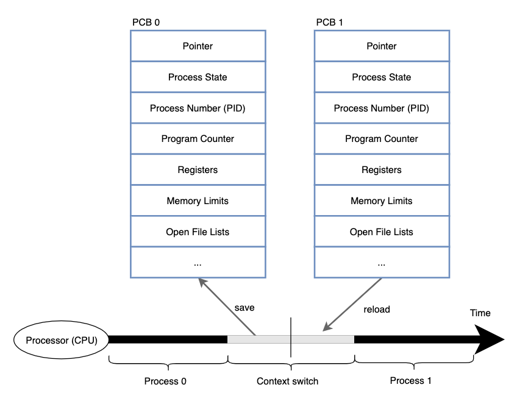
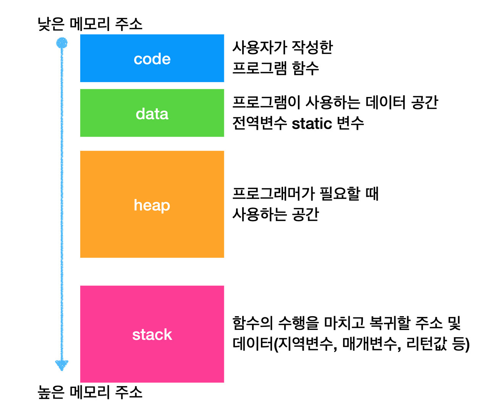

# 프로세스와 스레드
목차
1. [프로세스(Process)](#프로세스(Process))
2. [프로세스 상태와 계층 구조](#프로세스-상태와-계층-구조)
---
## 프로세스(Process)
> 프로세스(process) 는 실행 중인 프로그램(보조기억장치에 저장된 프로그램을 메모리에 적재하고 실행하는 순간)을 의미.
>  * 포그라운드 프로세스(foreground process) : 사용자가 보는 앞에서 실행되는 프로세스
>  * 백그라운드 프로세스(background process) : 사용자 뒤편에서 실행되는 프로세스
>   * 데몬(demon) : 사용자와 상호 작용하지 않는 백그라운드 프로세스(window 에서는 'Service')

### 프로세스 제어 블록(process control block, PCB)
> 프로세스와 관련된 정보를(context)를 저장하는 제어블록, 커널영역에서 생성됨.   
>  * 프로세스 생성 == PCB 생성 / 프로세스 종료 ==  PCB 폐기
* __PCB 저장되는 정보__
  1. Process ID(PID) : 특정 프로세스를 식별하기 위해 부여하는 고유 번호
  2. 레지스터값 : 해당 프로세스가 실행하며 사용했던 프로그램 카운터를 비롯한 레지스터값(레지스터값 복원시 사용)
  3. 프로세스 상태 : 프로세스 상태(입출력장치 대기 상태 등)를 저장
  4. CPU 스케쥴링 정보 : 프로세스가 언제 어떤 순서로 CPU를 할당 받을지에 대한 정보
  5. 메모리 관련 정보 : 프로세스마다 메모리에 저장된 위치가 다르기 떄문에, 베이스 레지스터, 한계 레지스터, 페이지 테이블 정보가 저장
  6. 사용한 파일과 입출력 장치 목록 : 프로세스 실행 과정에서 입출력장치와 파일 목록이 저장.

### 문맥 교환(context switching)
> 기존 프로세스 문맥을 PCB에 백업하고, 새로운 프로세스 문맥을 PCB로부터 복구하여 실행하는 것.
>

 * 문맥 교환 중에는 다른 작업을 할수 없다. 너무 잦은 문맥 교환은 오버헤드를 발생시킨다.

### 프로세스의 메모리 영역

* 정적 할당 영역 : code/data
* 동적 할당 영역 : heap/stack

> _메모리 누수(memory leack)_   
> 힙 영역(heap segment)은 프로그래밍 과정에서 메모리 공간을 할당 했다면 반드시 공간을 반환해야한다,
> 만약 공간을 반환하지 않는다면, 할당 공간으로 인해 메모리 낭비가 발생하는데 이를 메모리 누수라고 한다.

---
## 프로세스 상태와 계층 구조

### 프로세스 상태

1. 생성 상태(new)
   * 메모리에 적재되어 PCB를 할당받은 상태

2. 준비 상태(ready)
   * 준비 상태에서는 CPU를 할당받아 실행 할 수 있지만, 기다리고 있는 상태
   * 준비 상태에서 프로세스 실행 상태로 전환 되는 것을 디스패치(dispatch)라고 한다.

3. 실행 상태(running)
   * CPU를 할당받아 실행 중인 상태
   * 타이머 인터럽트가 발생하면 준비상태가 된다.
   * 실행도중 입출력장치(혹은 이벤트 발생)를 사용할 경우, 입출력 장치 작업이 끝날때 까지 대기상태가 된다.
   
4. 대기 상태(blocked)
   * 입출력 작업을 요청한 프로세스가 입출력 작업이 끝날떄까지 대기하는 상태.
   * 입출력 작업이 완료되면 준비상태가 된다.

5. 종료 상태(terminated)
   * 프로세스가 종료된 상태, PCB와 프로세스가 사용한 메모리를 정리.

### 프로세스 계층 구조
> 프로세스는 실행 동중 시스템 호출을 통해 다른 프로세스를 실행 할 수 있다. 프로세스를 생성한 프로세스를
> __부모 프로세스(parent process)__, 생성된 프로세스를 __자식 프로세스(child process)__ 라고 한다.

#### 프로세스 생성 기법
* 부모프로세스는 fork 를 통해 자식프로세스를 생성하고, 자식 프로세스는 exec 을 통해 자신의 메모리공간을 다른 프로그램으로 교체된다.

  * fork() : 자기 자신 프로세스를 복사하는 [시스템 호출](./00%20이중모드와%20시스템호출.md)
  * exec() : 자신의 메모리 공가을 새로운 프로그램으로 덮어쓰는 시스템호출.

* exec()호출시 코드영역과 데이터 영역의 내용이 실행할 프로그램 내용으로 변경되고, 나머지 영역(heap,stack)은 초기화 된다.
* [프로세스 코드 예제](code/프로세스다루기.py)

