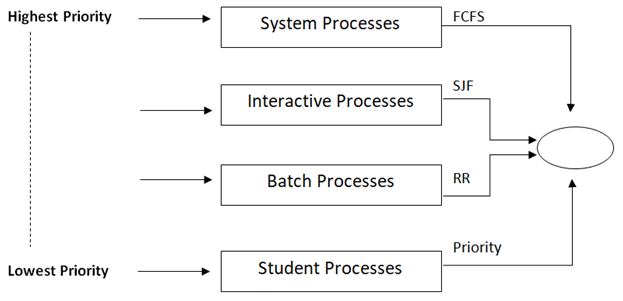

# CPU 스케쥴링
목차
1. [CPU 스케쥴링 개요](#CPU-스케쥴링-개요)
2. [CPU 스케쥴링 알고리즘](#CPU-스케쥴링-알고리즘)
3. [발전된 우선순위 스케쥴링](#발전된-우선순위-스케쥴링)

## CPU 스케쥴링 개요
> 운영체제가 프로세스들에게 공정하고 합리적으로 CPU자원을 배분하는 것.
> 
### 1. 프로세스 우선 순위
> 운영체제는 프로세스의 중요도에 프로세스마다 우선순위(prioriy)를 부여한다.
>

* 입출력 집중 프로세스(I/O bound process)
  * 비디오 재생, 디스크 백업 작업을 담당하는 등 입출력작업이 많은 프로세스
* CPU 집중 프로세스(CPU bound process)
  * 연산, 컴파일, 그래픽  처리등 CPU작업이 많은 프로세스

>  입출려 집중 프로세스 vs CPU 집중 프로세스
> 
>입출력 집중 프로세스는 CPU 사용 빈도가 낮다. CPU 자원을 사용한후 입출력장치를 작동시킬때 [대기상태](./01%20프로세스와%20스레드.md#프로세스-상태와-계층-구조)
가 되기때문에 먼저 입출력집중 프로세스를 실행시키고 CPU집중 프로세스를 실행히 집중적으로 CPU를 할당하는 것이 효율적이다.
> 즉 _입출력 집중 프로세스가 CPU 집중 프로세스보다 우선순위가 높게 할당되어야 바람직하다._

### 2. 스케쥴링 큐

> [프로세스 상태다이어그램](./01%20프로세스와%20스레드.md#프로세스-상태와-계층-구조)에서 스케쥴링 큐를 추가.   
> 출처 : 강민철님 , ⌜혼자 공부하는 컴퓨터구조 + 운영체제⌟, 한빛미디어, 2022, ~323

운영체제는 프로세스들을 큐에 넣어넣고 관리합니다. 실행을 마친 프로세스들은 각 준비큐/대기큐로 이동하며 각 큐에 프로세스들은 스케쥴링 알고리즘에 따른 우선순위 순서대로 실행됩니다.

### 3. 선점형 VS 비선점형 스케쥴링
* 선전혐 스케쥴링(preemptive scheduling)
  * 사용중인 프로세스로부터 CPU자원을 뺴앗아 다른 프로세스에 할당할 수 있는 스케쥴링 방식
  * 장점
    * 어느 한 프로세스의 자원 독점을 막고 프로세스 자원을 골고루 배분 할 수 있음
  * 단점
    * 문맥 교환 과정에서 오버헤드가 발생할 수 있음
   

* 비선점형 스케쥴링(non-premmptive scheduling)
  * 프로세스가 자원을 사용중일때 프로세스가 종료되거나 스스로 대기상태가 될때까지 다른 프로레스에게 자원을 할당하지 않는 스케쥴링 방식
  * 장점
    * 문맥교환에서 발생하는 오버헤드가 적음
  * 단점
    * 하나의 프로세스가 자원을 사용 중이라면 당장 자원이 필요한 프로세스도 무조건 대기해야함,

  
## CPU 스케쥴링 알고리즘

### 1. 선입 선처리 스케쥴링(FCFS, First Come First Serve)
> 준비 큐에 삽입된 순서대로 프로세스를 처리하는 _비 선전점형_ 스케쥴링 방식   
> 때떄로 프로세스들이 기다리는 시간이 매우 길어지는 __호위 효과(convoy effect)__ 가 발생한다.
* 호위효과(Convoy effect)   
만약 CPU 이용 시간이 짧은 프로세스가 이용 시간이 긴 프로세스보다 뒤에 큐에 삽입되어있다면. 짧은 실행시간에 비해 긴시간을 대기해야하는 경우가 발생하고 이를 호위효과라고 한다.

### 2. 최단작업 우선 스케쥴링(SJF, Shortest Job First)
> 준비 큐에 프로세스들 중 cpu 이용시간이 짧은 프로세스 부터 실행하는 스케쥴링 방식 
 * 호위 효과를 방지할 수 있다.

### 3. 라운드 로빈 스케쥴링(RR,Round Robin)
> 정해진 __타임 슬라이스__ 만큼 프로세스를 실행하고, 프로세스가 종료되지 않아도 타임 슬라이스를 모두 사용하면 큐에 맨뒤로 프로세스를 삽입하는 _선점형 스케쥴링_ 방식   
 * 타임 슬라이스   
 각 프로세스가 CPU를 사용할 수 있는 정해진 시간을 의미한다. 타임 슬라이스 크기가 너무 길어지면 FCFS와 다를바 없이 호위효과가 발생할 수 있으며, 너무 짧으면 문매 교환에 발생하는 비용이 너무 커지기 때문에 타임슬라이스의 크기 설정이 매우 중요하다.

### 4. 최소 잔여 시간 우선 스케쥴링(SRT, Shortest Remaining Time)
> 타임슬라이스만큼 프로세스를 실행하고, 그 후 남아있는 작업 시간이 가장 적은 프로세스를 선택한다.
> --> 라운드 로빈 + SJF 

## 발전된 우선순위 스케쥴링

### 1. 기아(starvation) 과 에이징(aging) - 우선순위 스케쥴링의 문제점

* 기아(starvation)
  * 우선순위 스케쥴링(SJF,SRT ..)에서 우선순위가 낮은 프로세스 실행이 지속적으로 연기 되는 현상.

* 에이징(aging)
  * 오랫동안 대기한 프로세스의 우선순위를 점차 높여가는 것. 기아현상을 방지하는 대표적인 방식.

### 2. 다단계 큐 스케쥴링(MLQ, Multi-Level Queue) - 발전된 우선순위 스케쥴링

> 우선순위별로 준비 큐를 여러 개 사용하는 스케줄링 방식. 프로세스 유형별로 우선순위를 구분하여 실행하며 큐마다 다른 스케쥴링 알고리즘을 적용할 수 있다.
* 프로세스들이 큐 사이를 이동할 수 없기때문에, 기아 현상이 발생할 수 있다.

### 3. 다단계 피드백 큐 스케쥴링(MLFQ, Multi-Level FeedBack Queue)

> MLQ와 달리 프로세스들이 큐사이를 이동할 수 있다. 
> 1. 다단계 피드백 큐에서는 새로 준비상태가 된 프로세스가 있다면 우선 우선순위를 가장 높게 할당해 가장 높은 우선순위 큐에 삽입하고 실행한다.   
> 2. 만약 프로세스가 타임슬라이스동안 실행이 끝나지 않는다면, 다음 우선순위 큐에 삽입 된다.
> 3. 낮은 우선순위 큐 에서 너무 긴 대기시간을 보내는 프로세스들은 우선순위 높은 큐로 삽입하여(에이징)
> 기아(starvation) 현상을 방지한다.

 * 이 과정을 반복하면 I/O 집중 프로세스 우선순위는 높아지고 CPU 집중 프로세스 우선순위는 낮게 할당된다.
 * __가장 일반적인 CPU 스케쥴링 알고리즘 이다.__

