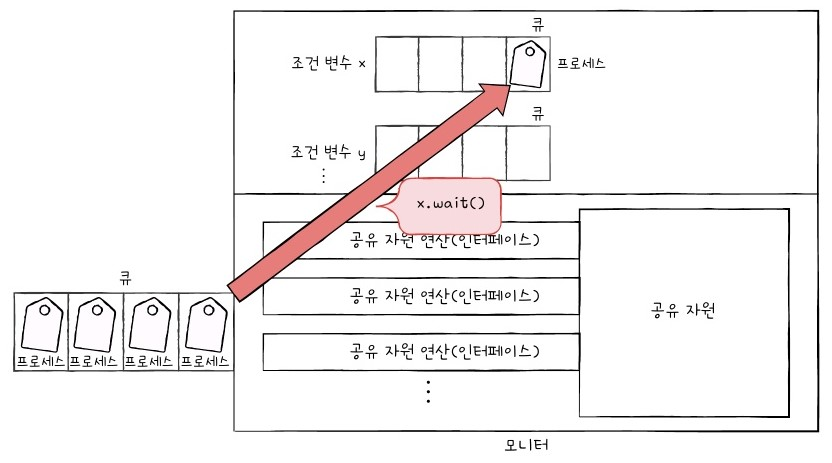

# 프로세스 동기화

* 목차
1. [동기화(Synchronization)란?](#동기화란)
2. [동기화 기법](#동기화-기법)


## 동기화란
> 동시다발적으로 실행되는 프로세스들의 __실행 순서와 자원의 일관성을 보장하는 것__.

### 1. 동기화의 의미
* 실행 순서 제어 : 프로세스를 올바른 순서대로 실행하기
* 상호 배제(mutual exclusion): 동시에 접근해서는 안 되는 자원에 하나의 프로세스만 접근하게 하기

### 2. 공유자원과 임계구역
* 공유자원(shared resource)   
  * 프로세스들이 공동으로 점근하는 자원
* 임계구역(critical section)
  * 공유자원중 두개이상의 프로세스가 동시에 접근할 경우 문제가 생기는 코드 영역
* 레이스 컨디션(race condition)
  * 프로세스가 동시 다발적으로 임계구역의 코드를 실행의 문제가 발생하는 경우


## 동기화 기법

### 1. 뮤테스 락(Mutex lock)
> 뮤텍스 락은 락(lock)을 획득한 스레드만이 공유 데이터에 접근할 수 있게 하고, 다른 스레드들은 락을 획득할 때까지 대기하도록 한다.

* 뮤테스 락 구현
1. lock(): 프로세스들이 공유하는 전역변수 lock()
2. acquire(): 임계구역 lock이 닫혀있다면(true) 이면 열릴때까지(false)가 될때까지 임계구역을 확인하고, 임계구역이 열려있다면 임계구역을 닫는다.
3. relaese(): 임계구역에서의 작업이 끝난 후 임계구역 lock 열어(false)준다.

> 1. Thread1 임계구역 접근 -> lock == false(열려있음)
> 2. acquire() -> lock = true(lock 닫기) 
> 3. 임계구역 코드 실행 -> lock = true 
>    * Thread2는 acquire로 임계구역이 true임을 계속 확인 
> 4. Thread1 임계구역 내 코드 실행
> 5. release() -> lock == false(lock 열면서 임계구역 나오기)
>   * Thread2는 acquire로 임계구역이 false임을 확인하여 임계구역에 접근하고 lock = true 로 바꿈

* 여기서 Thread2는 계속해서 acquire 함수로 lock을 반복적으로 확인한다. 이를 __바쁜 대기(busy wait)__ 라고 한다
    * 문제점
      1. cpu자원낭비 : 락을 기다리는 스레드가 cpu를 계속 사용
      2. 무한대기 문제 : 락을 해제하지 못하면 무한 대기에 빠져 deadrock 유발 
      3. 우선순위 역전 문제 : 우선순위가 낮은 스레드가 락을 점유하는동안 우선순위가 높은 스렏드가 기다려야하는 상황
* 뮤텍스 락을 구현할 때는 대기 큐에 스레드를 삽입해 대기시키는 방법으로 바쁜대기 문제를 예방할 수 있다.

### 2. 세마포(semaphore)
> 하나 이상의 공유 자원에 대한 접근을 제어하는 데 사용될 수 있다.

* 세마포 구현
1. S : 임계구역에 진입할 수 있는 프로세스 개수를 나타내는 전역변수
2. wait() : 임계 구역에 들어가도 좋은지, 기다려야 할지를 알려주는 함수
3. signal(): 임계 구역 앞에서 기다리는 프로세스에게 실행 신호를 주는 함수

> s = 2 일떄
> 1. thread1 이 wait() 함수를 호츨해 S > 0 일경우 S-- 연산을 한후 임계구역에 진입
> 2. thread2 wait() 함수 호출 S--;
>    * thread3 wait() 함수 호출 s == 0 이므로 대기
> 3. thrade1 임계구역 코드 실행후 signal() 호출 s++;
> 4. thread3 wait() 함수 호출 S--;

* 뮤테스 락과 마찬가지로 바쁜대기 문제가 발생할 수 있으니 준비 큐를 사용한다.

> * 세마포로 실행 순서 제어하기
> 1. s=0으로 초기화한다.
> 2. 먼저 진행할 thread에 임계구역 뒤에 signal()
> 3. 후에 진행할 thread에 임계구역 앞에 wait()


### 3. 모니터(monitor)

> 공유자원과 공유자원에 접근하기 위한 인터페이스(메소드)를 묶어 관리한다.   
> * 프로세스는 반드시 인터페이스를 통해 공유자원에 접근하며, 모니터에는 항상 하나에 프로세스만 접근가능하다.   
> * 프로세스들은 상호 배제를 위한 큐에 삽입되어 하나씩 모니터에 접근하게 된다.
> 
* Java synronaized 코드 예시
```java
  public class BankAccount {
    private int balance;

    public synchronized void deposit(int amount) {
        balance += amount;
        System.out.println("Deposited " + amount + ", current balance is " + balance);
    }

    public synchronized void withdraw(int amount) {
        if (balance >= amount) {
            balance -= amount;
            System.out.println("Withdrew " + amount + ", current balance is " + balance);
        } else {
            System.out.println("Cannot withdraw " + amount + ", insufficient balance");
        }
    }
  }
```

withdraw() 와 deposit()은 balance라는 공유자원에 접근하기 위한 메소드이며, 둘 중 하나에 메소드가 실행 되고있을겨우 다른 메소드는 실행되지 않는다.(상호배제)

* 조건변수 wait(),signal()을 활용해 실행 순서 제어도 가능하다.
* 조건변수에 의해 대기할때는 상호배제를 위한 큐가 아닌, 조건 변수에 대한 큐에 삽입된다.


