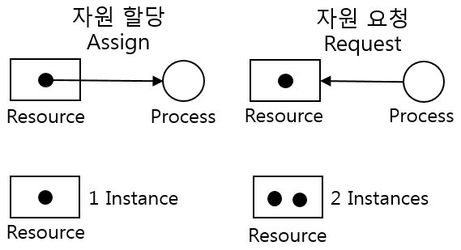

# 교착 상태
* 목차
1. [교착 상태란](#교착-상태란)
2. [교착 상태 해결 방법](#교착-상태-해결-방법)

## 교착 상태란
> 상호 배제에 의해 나타나는 문제점으로, 둘 이상의 프로세스들이 자원을 점유한 상태에서 서로 다른 프로세스가 점유하고 있는 자원을 요구하며 무한정 기다리는 현상을 의미합니다

### 1. 자원 할당 그래프(resource-allocation graph)

* Process -> Circle
* Resource Type -> Square
* Number of Resource -> dot

### 2. 교착 상태 발생 조건
> 교착상태는 다음 4가지 필요 조건이 모두 만족 해야 발생 한다.
1. 상호 배제(mutual exclusion)   
    * 근본적인 원인은 자원을 한 번에 하나에 프로세스만 이용 가능했기 때문에 발생한다.
2. 점유와 대기(hold and wait)
    * 자원을 할당받은 상태에서 다른 자원을 할당받기를 기다리는 상태 일때 발생
3. 비선점(nonpreemptive)
    * 프로세스가 자원을 비선점 하기 때문에 발생
4. 원형 대기(circular wait)
    * 프로세스들이 원의 형태로 대기 할때 발생
    * 즉 자원 할당 그래프가 원의 형태로 나타나면 발생할 수 있다. 주의할 점은 원의 형태를 띈다고 해서 반드시 교착 상태가 발생하는 것은 아니다.

## 교착 상태 해결 방법
> 운영체제는 크게 예방/회피/검출 후 회복 으로 교착 상태를 해결 한다. 

### 1. 교착 상태 예방
> 교착 상태 발생 [필요 조건](#2.-교착-상태-발생-조건) 을 충족하지 못하게 하는 방법.
>
* 상호 배제
  * 모든 자원을 공유 가능하게 만들면 상호배제가 생기지 않아 교착상태가 발생하지 않는다.
  * 하지만 이방식을 현실에서 적용하기에는 무리가 있다.
* 점유와 대기 
  * 운영체제가 특정 프로세스에 자원을 모두 할당하거나, 아예 할당하지 않는 방식으로 배분
  * 자원의 활용률이 낮아진다.
  * [starvation](./02%20CPU%20스케쥴링.md#발전된-우선순위-스케쥴링) 유발

* 비선점 조건
  * 선점하여 사용할 수 잇는 일부 자원에 대해서 효과적
  * CPU등은 선점가능하기 때문에 사용가능 하다.
  * 그러나 프린터기 등 선점할 수 없는 자원들이 있기때문에, 범용적이지는 않다.

* 원형대기 조건
  * 

